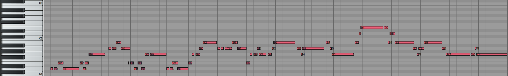

# Automatic Music Arrangement

## About
This software can arrange music automatically based on user-input melody MIDI files and styles, along with a command-line interface. It can perform:
- Key estimation (can also be specified explicitly by the user)
- Chord progression estimation (can also be specified explicitly by the user)
- Perform music editing based on the styles

<b>Caution: This is a university student project (Computer Music Development 2021 in CUHK) and it is mainly for learning purpose. Therefore, it is very basic and not a production-ready tool for professionals.</b>

## Demo
We have prepare two melody files and two example style files.
- Style 1: [Piano](example-style-piano.lua)
- Style 2: [Rock](example-style-rock.lua)

The following tests are all using this [settings file](test-settings.lua).

### Melody 1 - Canon
Melody MIDI: [Link](Demo/canon-melody.mid)

#### Example Style - Piano
MIDI: [Link](Demo/canon-piano.mid)

https://user-images.githubusercontent.com/48320629/146743713-54f0d8be-f708-4674-a209-69d2b95643ef.mov

#### Example Style - Rock
MIDI: [Link](Demo/canon-rock.mid)

https://user-images.githubusercontent.com/48320629/146743133-31b68dbf-a4ef-4161-9de2-e8dcf70303a2.mov

### Melody 2 - Country Road
Melody MIDI: [Link](Demo/country-road-melody.mid)

#### Example Style - Piano
MIDI: [Link](Demo/country-road-piano.mid)

#### Example Style - Rock
https://user-images.githubusercontent.com/48320629/146744634-6e85fc74-f17f-4cfe-a71e-39346acfb77d.mov

MIDI: [Link](Demo/country-road-rock.mid)

https://user-images.githubusercontent.com/48320629/146744646-e2266056-6e16-4e2d-b192-7e78428cd994.mov

## How to Use
This software requires Lua 5.3 to run. Also download the modified LuaMidi library down below and rename the folder as `LuaMidi` and place it under the root directory of this program.

It can be run with command: `Lua main.lua -i melody.mid -o arrangement.mid -s style.lua -c settings.lua`

| Command | Description |
| --- |---| 
| -h, --help | Print all the commands |
| -v, --version | Print current version |
| -i, --input MELODY_FILE_PATH | Specify the path of the melody file (MIDI file) |
| -s, --style STYLE_FILE_PATH | Specify the path of the style file (Lua file) |
| -o, --output OUTPUT_FILE_PATH | Specify the path of the output file (MIDI file) |
| -c, --settings SETTINGS_FILE_PATH | Specify the path of the settings file (Lua file) 

Note: Since this program does not utilise different MIDI channels for different tracks, all tracks will be in piano if you use a typical MIDI player to playback the output file.

### Melody File
A melody file is a MIDI file with only one track (or else the last track will be chosen as the melody track). It is not neccessary for the melody track to be monophonic. Actually, the program would work better if there is harmonies.

### Style File
A style file returns a table that contains basic information such as author name, version number, and most importantly an `arrange` that defines how should the program arrange the music based on the arrangement context (melody, key, chord progression, etc).

If you want to create your own style file, please read the provided example and the `MusicEditing` APIs.

### Settings File
A settings file is
for overriding the information calculated by the program or defined by default. It returns a table that may include the following information:
- Key (optional)
- Tempo (optional)
- Time signature (optional)
- Section separation (compulsory)
- Chord progression (optional)

## Known Issues
- If two notes with the same channel and pitch have no space in-between (i.e. the note-off event time of the first note and the note-on event time of the second note are the same), it may cause some issues. Therefore, it would be better to avoid them when making resource MIDI files.

## Credits
- <b>Supervisor:</b> Chuck-jee Chau
- <b>Project Manager & Lead Programmer:</b>	Ka-wing Ho
- <b>Programmers:</b>
  - Sen-ho Choi (chord adpation and key & chord progression estimation)
  - Man-hin Lai (MIDI editing functions and CLI)
  - Chun-sang Lam (MIDI editing)

## Library
This software utilised a modified version of LuaMidi: https://github.com/CUHK-CMD/LuaMidi

## License
This software is under MIT licennse, see `LICENSE` for details.

